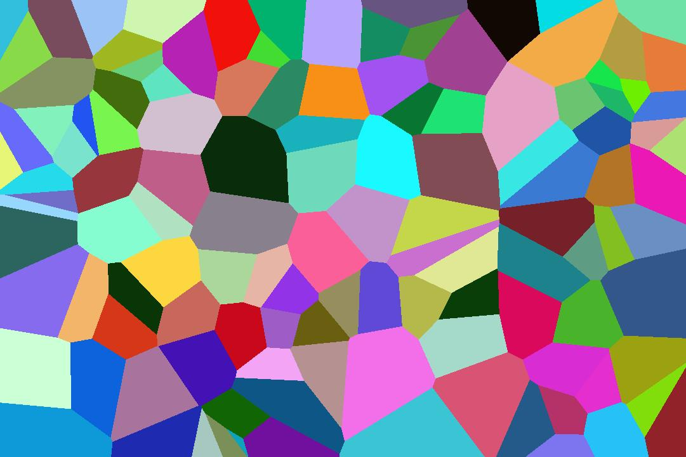

# Voronoiex

Generates a multicolored voronoi jpeg, or a voronoi ASCII drawing.

Served over API as well, for some reason.

## Running the API

`mix run --no-halt`

Then access via `localhost:4000`, optionally with query parameters: `localhost:4000?n=50&width=1080&height=720` which generates a jpeg of 50 sites that is 1080x720 pixels.

